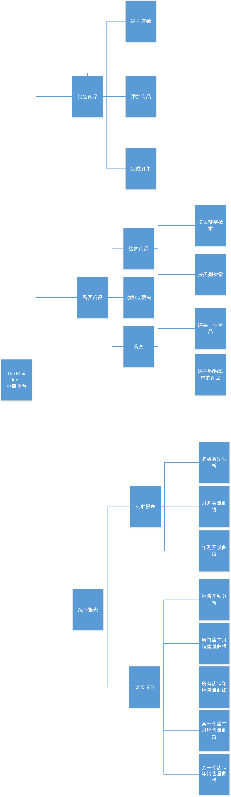
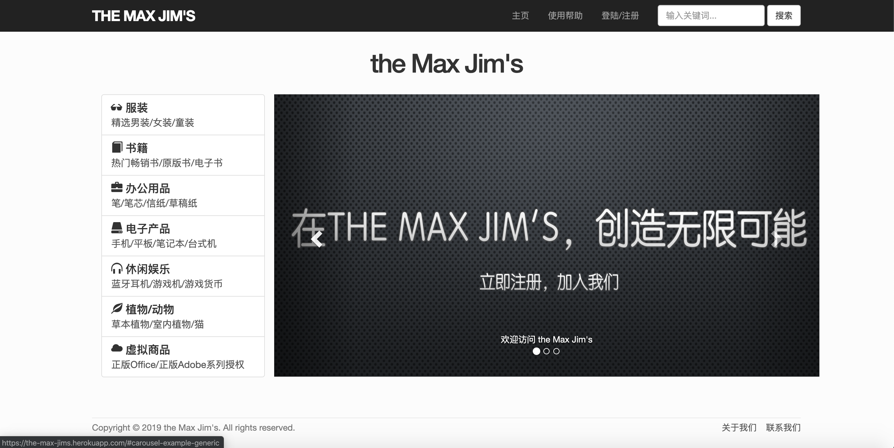
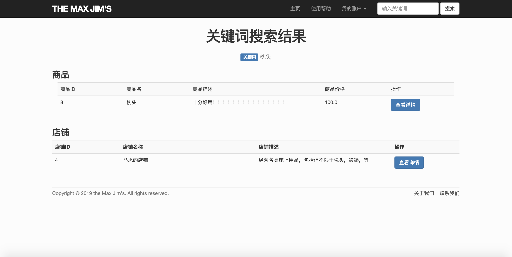
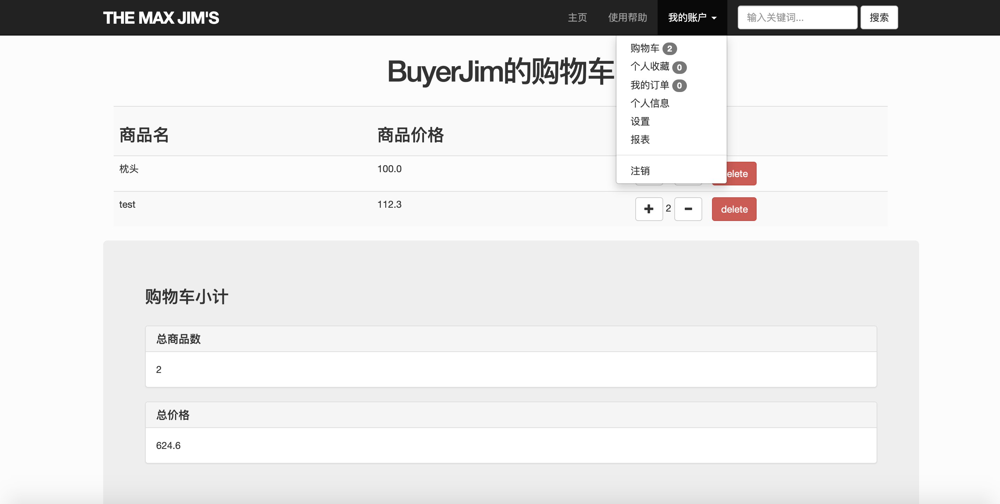
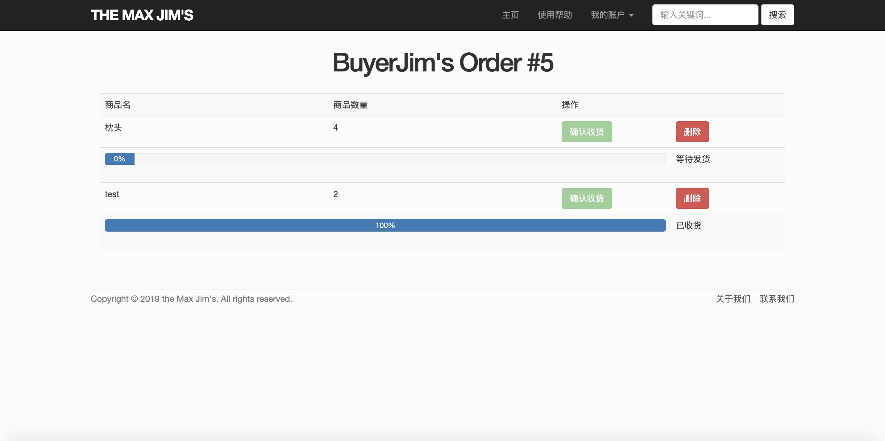
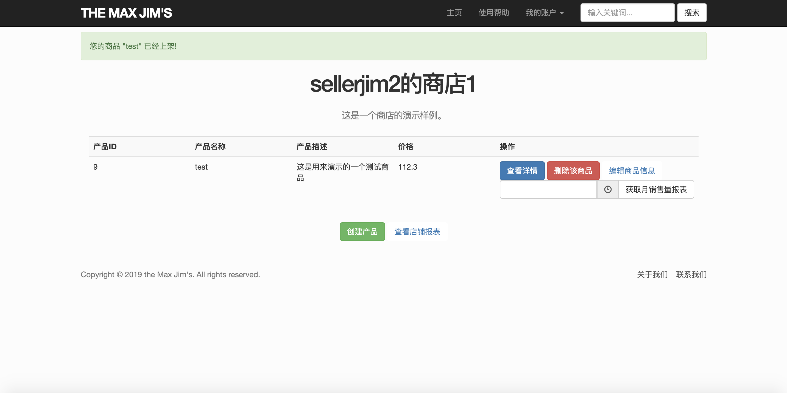
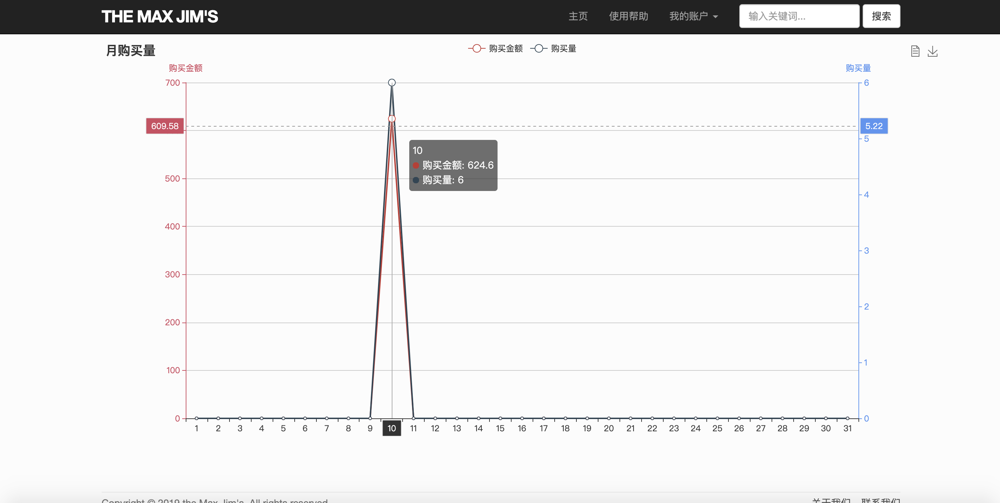
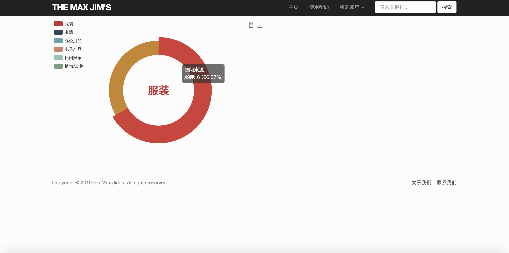
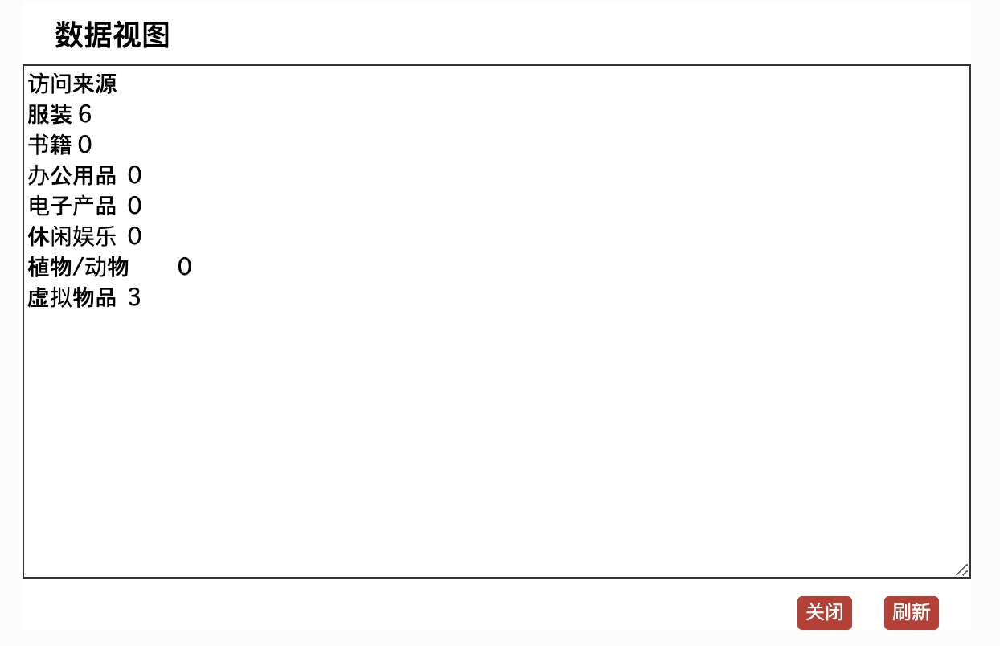

#数据库课程设计系统实现总结报告

## 实现环境

本系统基于web开发框架Ruby on Rails编写，其中Ruby的版本为2.5.1，Rails的版本为5.2.3。

## 系统功能结构图


## 基本表的定义与完整性约束

- User

  | 属性                  | 类型    | 完整性约束                                                   |
  | --------------------- | ------- | ------------------------------------------------------------ |
  | id                    | integer | 主码，索引                                                   |
  | name                  | varchar | not null                                                     |
  | email                 | varchar | not null，且需满足正则表达式                                 |
  | character             | varchar | ('buyer', 'seller', 'administrator')                         |
  | create_at             | date    | （注：由Rails框架自动生成）                                  |
  | update_at             | date    | （注：由Rails框架自动生成）                                  |
  | password_digest       | varchar | （注：由加密模块自动生成，用户不具有对此项的直接修改和删除权限） |
  | receiver_name         | varcher | not null                                                     |
  | receiver_address      | varcher | not null                                                     |
  | receiver_phone_number | varcher | not null                                                     |

- Shop

  | 属性        | 类型    | 完整性约束                  |
  | ----------- | ------- | --------------------------- |
  | id          | integer | 主码，索引                  |
  | name        | varchar | 商店名                      |
  | description | varchar | not null                    |
  | user_id     | integer | 商店对应的用户id            |
  | create_at   | date    | （注：由Rails框架自动生成） |
  | update_at   | date    | （注：由Rails框架自动生成） |

- Product

  | 属性        | 类型    | 完整性约束                                                   |
  | ----------- | ------- | ------------------------------------------------------------ |
  | id          | integer | 主码，索引                                                   |
  | name        | varchar | not null                                                     |
  | description | varchar | not null                                                     |
  | price       | float   | price > 0                                                    |
  | shop_id     | integer | 外部码，reference Shop                                       |
  | category    | varchar | 取值域为('clothes','books', 'office', 'digital','entertainment', 'fruits_and_animals', 'virtual_items') |
  | create_at   | date    | （注：由Rails框架自动生成）                                  |
  | update_at   | date    | （注：由Rails框架自动生成）                                  |

- Order

  | 属性                  | 类型    | 完整性约束                                                   |
  | --------------------- | ------- | ------------------------------------------------------------ |
  | id                    | integer | 主码，索引                                                   |
  | receiver_name         | varcher | not null                                                     |
  | receiver_address      | varcher | not null                                                     |
  | receiver_phone_number | varcher | not null，且需要满足正则表达式                               |
  | status                | integer | 取值域为$\{i|0\leq i\leq4, i\in \N\}$，其取值分别对应状态：发货、装车、派件、等待确认收货、完成 |
  | order_time            | date    |                                                              |
  | total_price           | float   | total_price > 0                                              |
  | create_at             | date    | （注：由Rails框架自动生成）                                  |
  | update_at             | date    | （注：由Rails框架自动生成）                                  |
  | user_id               | integer | 外部码，reference User                                       |
  | link_order_id         | integer | 外部码，reference Order                                      |

- ShoppingCart

  | 属性      | 类型    | 完整性约束                  |
  | --------- | ------- | --------------------------- |
  | id        | integer | 主码，索引                  |
  | user_id   | integer | 外部码，reference User      |
  | create_at | date    | （注：由Rails框架自动生成） |
  | update_at | date    | （注：由Rails框架自动生成） |

- Favorite

  | 属性      | 类型    | 完整性约束                  |
  | --------- | ------- | --------------------------- |
  | id        | integer | 主码，索引                  |
  | user_id   | integer | 外部码，reference User      |
  | create_at | date    | （注：由Rails框架自动生成） |
  | update_at | date    | （注：由Rails框架自动生成） |

- OrderItem

  | 属性             | 类型    | 完整性约束                             |
  | ---------------- | ------- | -------------------------------------- |
  | id               | integer | 主码，索引                             |
  | product_id       | integer | 外部码，reference Product              |
  | amount           | integer | $amount\geq 0$                         |
  | order_id         | integer | 外部码，reference Order                |
  | corresponding_id | integer | 外部码，reference OrderItem            |
  | progress         | integer | 取值域为$\{i|0\leq i\leq 4, i\in \N\}$ |
  | total_price      | float   | total_price > 0                        |
  | create_at        | date    | （注：由Rails框架自动生成）            |
  | update_at        | date    | （注：由Rails框架自动生成）            |

- ShoppingCartItem

  | 属性             | 类型    | 完整性约束                     |
  | ---------------- | ------- | ------------------------------ |
  | id               | integer | 主码，索引                     |
  | product_id       | integer | 外部码，reference Product      |
  | amount           | float   | $amount\geq 0$                 |
  | shopping_cart_id | integer | 外部码，reference ShoppingCart |
  | create_at        | date    | （注：由Rails框架自动生成）    |
  | update_at        | date    | （注：由Rails框架自动生成）    |

- FavoriteItem

  | 属性        | 类型    | 完整性约束                  |
  | ----------- | ------- | --------------------------- |
  | id          | integer | 主码，索引                  |
  | product_id  | integer | 外部码，reference Product   |
  | favorite_id | integer | 外部码，reference Favorite  |
  | create_at   | date    | （注：由Rails框架自动生成） |
  | update_at   | date    | （注：由Rails框架自动生成） |

## 安全性设计

- 在我们设计的系统中，对于安全性的控制，主要是通过用户登录以及对用户进行分级控制，在我们的系统中，用户分为消费者、生产者以及管理员三类。而实现控制安全性，我们主要依靠的是框架的支持，我们认为数据库无法被任何用户通过直接登陆进行访问，即我们确保任何用户所有对于数据库的操作均需要通过前端的操作进行。基于此，我们设计了一套借助Rails框架实现的安全控制机制。

- 首先，我们定义一个公共的视图，未登录或者登陆且角色为消费者、生产者以及管理员的用户均可以访问。具体而言，是指所有商品的信息、店铺的信息以及如主页、关于我们等基本的静态页面。
- 其次，我们进行登陆控制，如果没有登陆，则只能够具有查看以上页面的权限。登陆后，按照权限进行访问。相比较于未登陆的用户，登陆的用户具有对自己的个人信息的查询以及修改权限，同时除管理员用户外，限制其对于其他用户的个人信息的访问以及修改。
- 然后，对于登陆后的用户的权限控制。对于消费者身份的用户，其还有对应的购物车、收藏夹以及订单列表，同时具有对自己的购物车、收藏夹以及订单列表项的插入、删除、修改、查询权限，同时除管理员用户外，限制其对于其他用户的任何信息的删除、修改以及插入。对于经销商身份的用户，其还有对应的店铺，每一个店铺具有对应的商品，同时也具有订单列表，并拥有对其中的表进行插入、删除、修改、查询的权限，同时限制其对于其他用户的任何信息的删除、修改以及插入。对于管理员用户，其具有最高的权限，拥有对于系统中的任何内容进行插入、删除、修改、查询的权限。

## 存储过程、触发器和函数的代码说明

## 主要技术

- Ruby on Rails。我们所使用的框架。体现了典型的MVC设计模式。其中，每一个model对应数据库中的一个基本表，对应的controller为当浏览器发出一条请求时，经过路由，对应触发控制器中的函数，每一个controller对应零至多个view，即具体进行呈现的视图。此框架的一个优点在于，对于数据库的操作并不直接进行，而是通过Ruby的代码对应生成SQL语句，同时对于数据库中基本表的完整性约束也并不是直接使用SQL语句进行添加，而是通过db目录下的migration文件编写，然后执行`rails db:migration`对数据库的完整性约束进行修改。这一特性使得此框架与底层的数据库高度解藕，因此在底层可以对使用的数据库进行较为自由的更换，更换后只要简单修改配置文件即可使用。因此，Rails框架默认使用的是Sqlite，而向Heroku部署时切换为PostgreSQL也比较方便。
- SQL。数据库的结构化查询语言。在我们的系统中的一些部分使用的SQL语句对数据库进行查询。

## 运行实例展示

- 为了方便查看我们的系统，我们将其部署到了Heroku上，这是一个Rails项目的托管平台，由于免费版的条件限制，服务器在网站30分钟内没有访问后进入休眠状态，因此第一次访问时加载时间比较长，此后即恢复正常。

- 网站的地址为：https://the-max-jims.herokuapp.com/

- 演示1：网站首页

- 演示2：注册页面，除注册页面外，还有创建店铺以及创建商品的页面，整体的页面布局大致相同。

- 演示3：搜索页面，根据输入的关键词，搜索相关商品以及相关店铺。

- 演示4：个人信息页面，登陆后会自动跳转至此页面，其中消费者、经销商以及管理员有不同的视图，下面展示的是经销商的视图。在我们的网站中，用户的头像直接链接Gravatar，登陆https://gravatar.com，使用注册时使用的邮箱登陆即可修改头像。

- 演示5：购物车，提供了对商品数量的调整、详细信息的查看以及一起结算的功能。

- 演示6：订单以及具体的订单项。这里关于订单的进度，由于并不能像真正的电商网站一样链接对应的快递进度，所以在我们的项目中由经销商以及消费者共同调整进度。消费者下单后，订单初始进度为等待发货，此时经销商通过点击按钮进行更新，行为分别是发货、装车、派送，此后进度变为等待收货，由消费者点击确认收货后，订单完成。

  

  

- 演示7：商店列表。

- 演示8：报表功能，其中对于报表，我们提供两种视图，一种是图形化的折线图以及饼图，反映的是消费者的购买量、购买的兴趣分类占比、经销商的商品以及店铺的销售情况以及历史热销产皮，另一种是列表式的表单，默认展示第一种，如果要查看列表式的表单，点击表单页面右上角的按钮，另外也提供表单的下载功能。

  

  

## 源程序说明

由于我们源程序的总代码量比较大，因此无法对所有代码进行说明，这里仅截取关键部分进行说明。

- 路由

  在Rails中，路由的控制是通过`config/locales/route.rb`实现的。当用户浏览器向服务器发出请求后，由路由对请求作出解析，然后对应地定向到相应的控制器中的函数中。

  ```ruby
  root 'static_pages#home'	# 设置根路由，即访问根目录时的路由
  ... ...
  get '/sign_up', to: 'users#new'	# 相应get请求
  post '/sign_up', to: 'users#create'	# 相应post请求，用于表单的提交与用户的创建
  ... ...
  delete '/logout', to: 'sessions#destroy'
  ... ...
  delete '/orders/:order_id/:order_item_id', to: 'order_items#destroy', as: 'order_item_destroy'	# 删除订单项时发出的请求
  ... ...
  resources :users	# 这是创建rails的model对象所自带的路由，包括了增删改查的操作
  ... ...
  get '*a', to: 'static_pages#invalid_get_handler'	# 安全性控制，对于没有在上述中出现的请求，会被处理，防止造成访问错误或者非法访问
  ```

- 模型（Model）

  所有的模型均位于`app/models`下，每一个model对应数据库中的一个基本表。在每一个model中的文件中，定义了对应名称的model类，同时在类中对model进行了约束，这些约束会在创建model，即向基本表中插入时由Rails框架进行校验。

  ```ruby
  class User < ApplicationRecord
    before_save { self.email = email.downcase }
    # 在执行model_example.save()之前，将email统一转换为小写格式，用于对email的唯一性进行验证
  
    validates :name, presence: true, length: {maximum: 50}
    # 限制名字不能为空，并且长度不超过50个字符
  
    VALID_EMAIL_REGEX = /\A[\w+\-.]+@[a-z\d\-.]+\.[a-z]+\z/i
    validates :email, presence: true, length: {maximum: 255},
              format: {with: VALID_EMAIL_REGEX},
              uniqueness: {case_sensitive: false}
    # 使用正则表达式对邮箱格式进行检查
  
    CHARACTERS = %w(buyer seller administrator)
    validates_inclusion_of :character, :in => CHARACTERS
    # 检查角色是否属于属性域中
  
    CHARACTERS_DOWN_LIST = {'买家': 'buyer', '卖家': 'seller', '管理员': 'administrator'}
  
    has_secure_password
    validates :password, presence: true, length: {minimum: 6}, allow_nil: true
    # 使用bcrypt对用户输入的密码进行高强度加密
  
    VALID_RECEIVER_PHONE_REGEX = /\A(\d{11})?\z/i
    validates :receiver_phone_number, format: {
      with: VALID_RECEIVER_PHONE_REGEX, message: '手机号应该包含11位数字'}
  
    has_many :shops, dependent: :delete_all
    has_one :shopping_cart, dependent: :destroy
    has_one :favorite, dependent: :destroy
    has_many :orders, dependent: :delete_all
    # 建立基本表之间的联系，与基本表中的参照关系和被参照关系相对应
  end
  ```

- 控制器（Controller）

  所有的控制器均位于`app/controllers`下，用于相应用户的请求，执行相关的函数，跳转到相应的页面，在这里我们仍以User的控制器为例。

  ```ruby
  class UsersController < ApplicationController
    before_action :logged_in_user, only: [:show, :edit, :update]
    before_action :correct_user, only: [:show, :edit, :update]
    before_action :correct_user_seller, only: [:show_shops]
    before_action :correct_user_admin, only: [:destroy]
  	# 在控制器处理路由响应之前进行的操作，用于进行访问控制，是安全性机制的一部分
    
    def show
      @user = User.find(params[:id])
    end
    # 对应用户的个人信息，这里设置的成员变量会传递给跳转到的用户的视图，在视图中使用嵌入式Ruby对其进行读取以及展示
  
    def new
      @user = User.new
    end
    # 对应用户的注册页面
  
    def create
      # deal with the POST request
      @user = User.new(user_params)
      if @user.email.split('@')[1].downcase != 'jimstudio.com' and @user.character == 'administrator'
        flash[:danger] = "要想注册成为管理员，则必须使用内部工作人员的域名为jimstudio.com的邮箱"
        render("new")
        return
      end
      # 检查注册使用的邮箱，这里我们假定只有拥有域名为'jimstudio.com'的邮箱的“内部员工”才能注册管理员账户
      
      if @user.save
        if @user.character == "buyer"
          ShoppingCart.new(user_id: @user.id).save
          Favorite.new(user_id: @user.id).save
        end
        # 为消费者创建购物车以及收藏夹
  
        log_in(@user)
        flash[:success] = "欢迎登陆 Max Jim's"
        # 闪现信息，刷新后即消失，借助layout中对应的单元进行实现
        
        redirect_to(@user)
        # 等价于redirect_to(user_path)
        
      else
        render("new")
        # 注册失败，刷新页面，并提示错误信息
      end
    end
    # 创建用户的过程
  
    def show_shops
      @user = User.find(params[:id])
      @shops = @user.shops.paginate(:page => params[:page], :per_page => 8)
      # 展示经销商的所有商店，这里使用的Twitter提供的框架Bootstrap，设置每一页显示的个数为8，超过8之后自动分页
    end
  
    def edit
      @user = User.find(params[:id])
    end
  
    def update
      @user = User.find(params[:id])
  
      if @user.update_attributes(user_params)
        flash[:success] = "成功修改!"
        redirect_to(@user)
      else
        render("edit")
      end
    end
  
    def destroy
      @user = User.find(params[:id])
      name = @user.name
      @user.destroy
      flash[:success] = "用户#{name}已经成功删除!"
      redirect_to(all_users_path)
    end
  
    private
  
    def user_params
      params.require(:user).permit(:name, :email, :character, :password, :password_confirmation, :receiver_name, :receiver_address, :receiver_phone_number)
  	# 对传入参数进行过滤，即安全参数，防止绕过图形化页面的表格提交非法参数
    end
  end
  ```

- 视图（View）

  使用控制器传入的变量，进行图形化的展示，内容均在`app/views`下，由于涉及到前端的html代码，长度稍大，因此截取其中一部分进行说明。

  ```html
  <div class="panel-heading">基本信息</div>
      <div class="panel-body">
         <section class="user_info">
         <div class="col-md-2">
             <div style="margin: 25px 25px 25px 50px;">
                <%= gravatar_for @user %>
              </div>
          </div>
          <div class="col-md-10">
             <h4>
                <div style="margin:20px"><%= @user.name %></div>
                <div style="margin:20px"><%= @user.email %></div>
                <% if @user.character == 'buyer' %>
                  <div style="margin:20px">买家</div>
                <% elsif @user.character == 'seller' %>
                  <div style="margin:20px">卖家</div>
                <% else %>
                  <div style="margin:20px">管理员</div>
                <% end %>
              </h4>
          </div>
      </section>
  </div>
  ```

  能看到，这里的`@user`即是上面控制其传入的一个对象的实例。`<% %>`与`<%= %>`为html中的嵌入式Ruby的代码，解释器会在生成视图时将其转换为html代码，其中前者表示只执行不显示，后者为显示。因此在上述的`if-else`语句块使用了前者，而显示用户信息的部分使用了后者。

- 报表功能

  以统计购买/销售类别为例，报表功能包括后端进行数据库查询和前端绘制图形两个部分。以下是进行数据库查询并统计的代码：

  ```ruby
  def category
    categories = Hash["clothes" => 0, "books" => 1, "office" => 2, "digital" => 3, "entertainment" => 4, "fruits_and_animals" => 5, "virtual_items" => 6]
    @sum = Array.new
    (0..6).each do |i|
      @sum[i] = 0
    end
    Order.where(user_id: params[:user_id]).find_each do |order|
      order.order_items.each do |item|
        product = item.product
        if categories.has_key?(product.category)
          @sum[categories[product.category]] += item.amount
        end
      end
    end
  end
  ```
  在数据库查询中，我们可以兼顾SQL语言与rails的优势。where方法类似于SQL中的where语句，我们也可以替换成嵌入式的SQL语句，把where提前可以把条件判断提前，提高查询的效率；find_each方法与更常用的each方法相比，rails框架对数据量很大时的情况进行了优化，当当前内存无法满足查询时，框架会自动进行批处理，缓解了数据量大时出现的性能不足问题。存储统计结果的数组@sum会被传递到前端进行绘图。
  

## 收获与体会

- Ruby on Rails框架以及MVC模式中的Model与数据库中实体的概念有很强的关联性，通过项目的实践，对数据库中实体的概念以及实体之间的联系有了更加深入的理解。
- 在动手前花足够的时间做好设计往往事半功倍。在写一两百行的小程序时我们往往习惯边写边改，然而对于数据库课程设计这样的大型项目，E-R图等设计文档在写代码的过程中会为使我们写代码时更加游刃有余。
- 善于利用别人优秀的开源成果。这次项目中使用的Ruby on Rails框架对MVC模式以及数据库的操作做了很多规范与抽象，而echarts和一些开源的js插件也帮助我们顺利地完成了前端的编写，在巨人的肩膀上工作可以使我们更加关注到问题的本质并避免在一些细枝末节上重复劳动。
- 利用git和GitHub进行项目管理和多人协作。这次项目是两人通过GitHub协作完成，GitHub这样的平台使多人协作变得方便。
- 技术是复杂的。除了数据库操作、统计报表等“核心功能代码”，我们还花费了大量时间构建并美化前端、建立权限管理机制以及调试各种bug等，一个复杂项目的完成需要对各种技术都有充分的了解。

