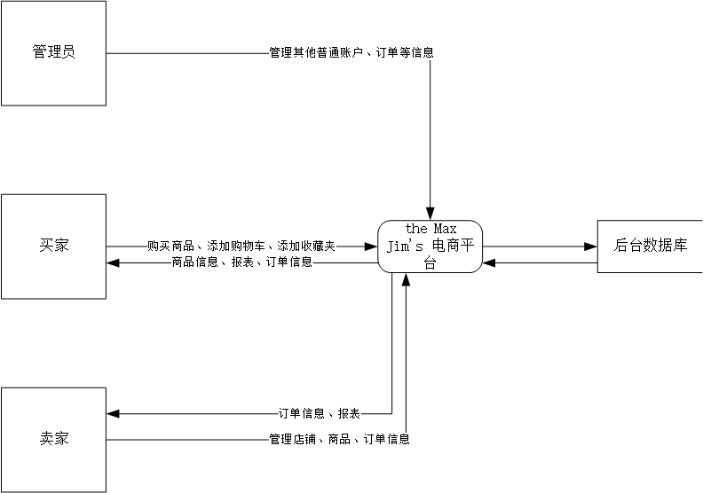
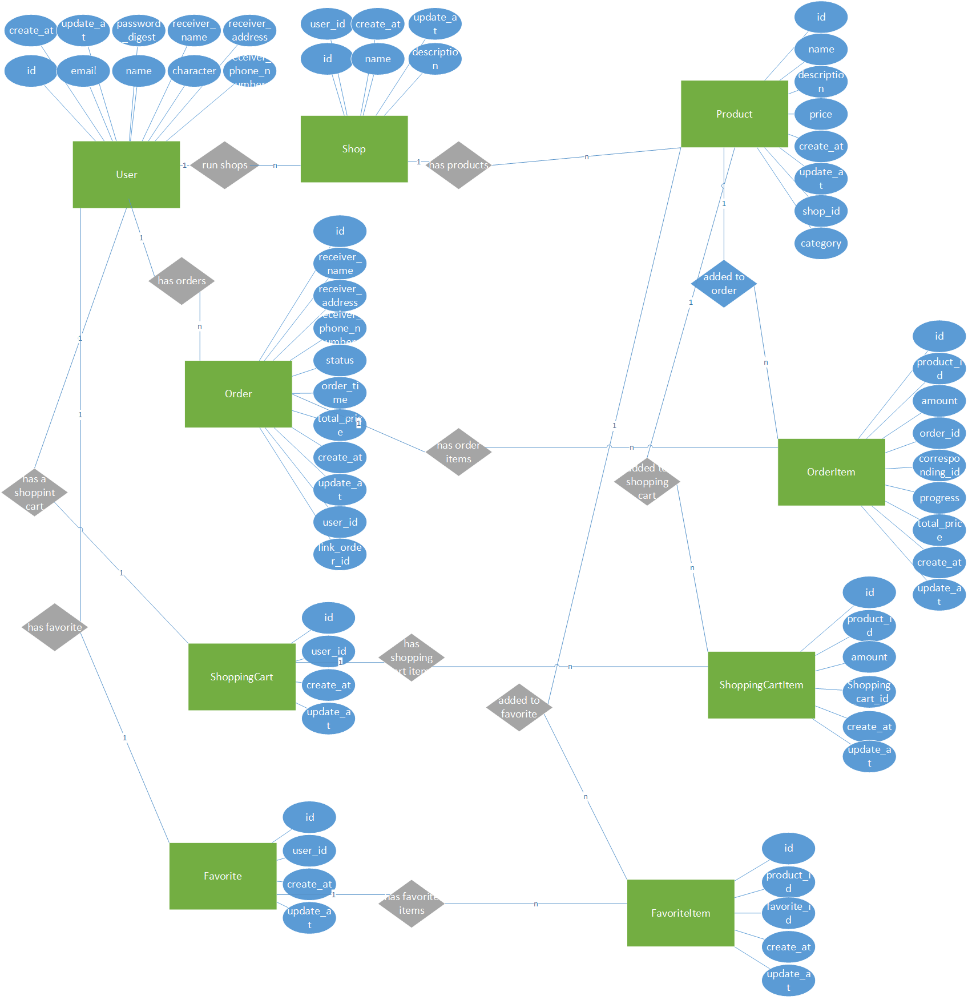

# 数据库课程设计系统设计报告

## 系统需求分析

- 需求分析

  我们的系统目标在于模拟实现一个网络电商平台。在这样一个情景设定下，对用户的分类，可以分为消费者、经销商以及系统管理员。对于消费者，消费者可以浏览商品，将商品加入自己的收藏或者购物车，能够购买商品，同时对应地有自己的收藏清单、购物车以及订单列表，同时当订单状态变为等待收货时，消费者可以通过确认收货修改订单状态。对于经销商，经销商可以创建店铺，同时在店铺里可以创建商品，可以修改订单状态。对于管理员，其可以查看所有用户、店铺等信息并进行插入、删除、修改、查询等任何操作，具有最高的权限。我们要实现的是一个能够将三类用户赋予不同的权限，同时为三类用户建立起一个交互机制的数据库系统。

- 数据流图

	

  

- 数据元素表

  - User

    | 属性                  | 类型    | 说明                                                         |
    | --------------------- | ------- | ------------------------------------------------------------ |
    | id                    | integer | 用户id                                                       |
    | name                  | varchar | 用户昵称                                                     |
    | email                 | varchar | 用户电子邮箱                                                 |
    | character             | varchar | 用户角色，取值域为('buyer', 'seller', 'administrator')，分别代表消费者、经销商以及管理员。 |
    | create_at             | date    | 创建日期                                                     |
    | update_at             | date    | 更新日期                                                     |
    | password_digest       | varchar | 密码（加密后）                                               |
    | receiver_name         | varcher | 收货人姓名                                                   |
    | receiver_address      | varcher | 收货地址                                                     |
    | receiver_phone_number | varcher | 收货人电话                                                   |

  - Shop

    | 属性        | 类型    | 说明             |
    | ----------- | ------- | ---------------- |
    | id          | integer | 商店id           |
    | name        | varchar | 商店名           |
    | description | varchar | 商店简介         |
    | user_id     | integer | 商店对应的用户id |
    | create_at   | date    | 创建日期         |
    | update_at   | date    | 更新日期         |

  - Product

    | 属性        | 类型    | 说明             |
    | ----------- | ------- | ---------------- |
    | id          | integer | 商品id           |
    | name        | varchar | 商品名           |
    | description | varchar | 商品简介         |
    | price       | float   | 价格             |
    | shop_id     | integer | 商品所属的店铺id |
    | category    | Archer  | 商品类别         |
    | create_at   | date    | 创建日期         |
    | update_at   | date    | 更新日期         |

  - Order

    | 属性                  | 类型    | 说明                                   |
    | --------------------- | ------- | -------------------------------------- |
    | id                    | integer | 订单编号                               |
    | receiver_name         | varcher | 收货人姓名                             |
    | receiver_address      | varcher | 收货地址                               |
    | receiver_phone_number | varcher | 收货人电话                             |
    | status                | varcher | 订单状态                               |
    | order_time            | date    | 下单日期                               |
    | total_price           | float   | 总价                                   |
    | create_at             | date    | 创建日期                               |
    | update_at             | date    | 更新日期                               |
    | user_id               | integer | 订单所属的用户的id                     |
    | link_order_id         | integer | 经销商一侧的订单所关联的消费者的订单id |

  - ShoppingCart

    | 属性      | 类型    | 说明                 |
    | --------- | ------- | -------------------- |
    | id        | integer | 购物车的id           |
    | user_id   | integer | 购物车所属的用户的id |
    | create_at | date    | 创建日期             |
    | update_at | date    | 更新日期             |

  - Favorite

    | 属性      | 类型    | 说明                 |
    | --------- | ------- | -------------------- |
    | id        | integer | 收藏夹的id           |
    | user_id   | integer | 收藏夹所属的用户的id |
    | create_at | date    | 创建日期             |
    | update_at | date    | 更新日期             |

  - OrderItem

    | 属性             | 类型    | 说明                                   |
    | ---------------- | ------- | -------------------------------------- |
    | id               | integer | 订单项的id                             |
    | product_id       | integer | 订单项所对应的商品的id                 |
    | amount           | integer | 订单项所对应的商品数量                 |
    | order_id         | integer | 订单项所属的订单id                     |
    | corresponding_id | integer | 消费者或经销商相对于另一方的订单项的id |
    | progress         | integer | 订单项的进度                           |
    | total_price      | float   | 订单项所对应的商品总价                 |
    | create_at        | date    | 创建日期                               |
    | update_at        | date    | 更新日期                               |

  - ShoppingCartItem

    | 属性             | 类型    | 说明                     |
    | ---------------- | ------- | ------------------------ |
    | id               | integer | 购物车项的id             |
    | product_id       | integer | 购物车项所对应的商品id   |
    | amount           | float   | 购物车项所对应的商品数量 |
    | Shopping_cart_id | integer | 购物车项所属的购物车的id |
    | create_at        | date    | 创建日期                 |
    | update_at        | date    | 更新日期                 |

  - FavoriteItem

    | 属性        | 类型    | 说明                   |
    | ----------- | ------- | ---------------------- |
    | id          | integer | 收藏夹项的id           |
    | product_id  | integer | 收藏夹项所对应的商品id |
    | favorite_id | integer | 收藏夹项所属的收藏夹id |
    | create_at   | date    | 创建日期               |
    | update_at   | date    | 更新日期               |

## 数据库系统的概念模式

## 数据库系统的逻辑模式

- 由第一部分第三节的表格可知，所有关系中的每一个分量均是原子的，因此属于1NF。

- 由于每一个关系模式中候选码只有一个，并且均只包含一个属性即id，因此不存在非主属性对码的部分依赖，因此属于2NF。
- 由于每一个关系模式中候选码只有一个，并且均只包含一个属性即id，若$X\rightarrow Y$，则$X$必为主属性id，故$X$必含有码，即不存在非主属性对主属性的传递依赖，因此属于3NF。
- 由于每一个关系模式中候选码只有一个，并且均只包含一个属性即id，因此不存在主属性对码的不良依赖，因此属于BCNF。
- 上述的每个关系均不包含非平凡的多值依赖，因此属于4NF。

综上，范式等级为4NF。

